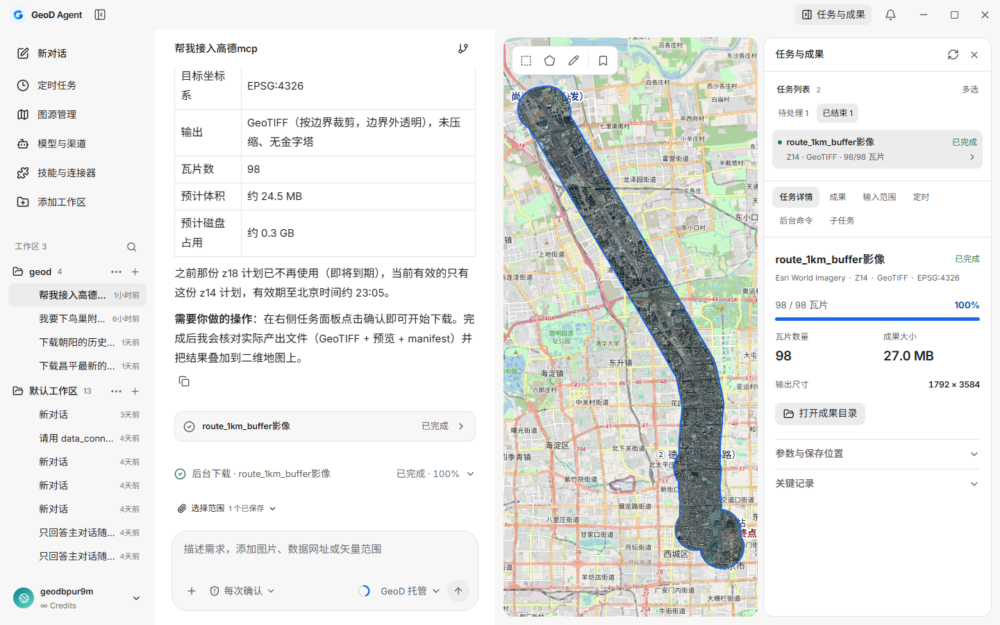
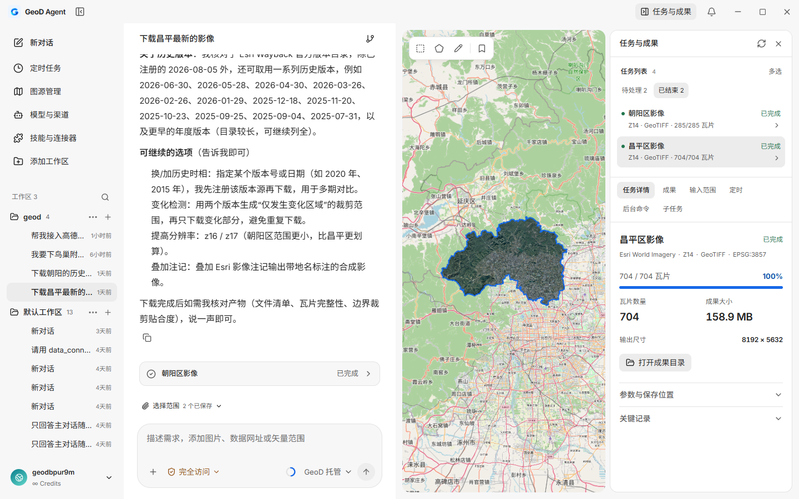
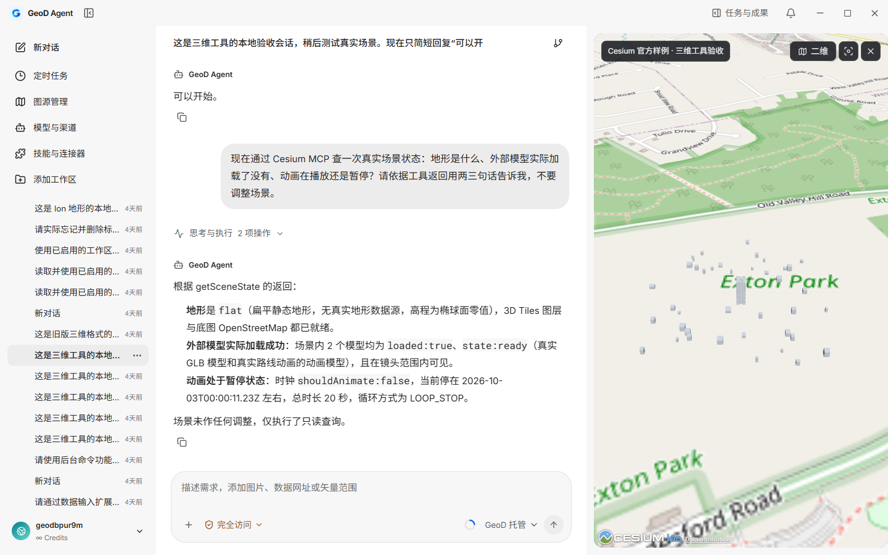

<h1 align="center">GeoD Agent</h1>

<strong>Configure sources. Plan tasks. Bring geographic data into your workspace.</strong>

AI conversations · Local downloads and processing · 2D / 3D maps · Skills and MCP

  
  
  
  

<a href="https://geod.laogao.xyz/en/agent"><strong>Website</strong></a> · <a href="https://github.com/gaopengbin/geod-agent/releases/tag/v0.2.3"><strong>Download Windows beta</strong></a> · <a href="https://geod.laogao.xyz/en/agent#demo">Watch demo</a> · <a href="https://github.com/gaopengbin/geod-agent/issues">Report an issue</a> · <a href="README.md">简体中文</a>

*Actual screenshots of the current light development build. Published releases and candidate improvements are identified separately.*

GeoD Agent is an independent Windows desktop application. Describe an area, data type and purpose, review the source and output parameters, then let your computer download, mosaic, crop and verify the files. Models organize the task and invoke tools; imagery tiles do not pass through the GeoD model server.

## Product demo

**[Watch the complete demo](https://geod.laogao.xyz/en/agent#demo)** · [Play / download MP4](https://geod.laogao.xyz/geod-site/agent/geod-agent-demo-20261008-v6.mp4)

Start from an empty conversation: configure imagery sources, prepare an MCP connection, confirm output parameters, download imagery, inspect results and create a scheduled task. Chinese narration and subtitles; thinking and waiting are accelerated. Recorded in the current development build; available features depend on the installed release.

## Release status

| Version | Status | Details |
| --- | --- | --- |
| **0.2.3** | Public Windows x64 beta | [Download installer](https://geod.laogao.xyz/agent-updates/windows-x86_64/0.2.3/GeoD%20Agent_0.2.3_x64-setup.exe) · [Release notes](docs/releases/0.2.3.md) |
| **0.2.4** | Local candidate; these changes have not been published | [Candidate notes](docs/releases/0.2.4.md) |

This README describes current code, including 0.2.4 changes. The public installer follows the 0.2.3 release notes. Source code is public under the [MIT license](LICENSE), and [GitHub release assets](https://github.com/gaopengbin/geod-agent/releases/tag/v0.2.3) are available directly. Version 0.2.4 remains a development candidate; clean Windows acceptance is pending.

## What can you configure through conversation?

| Data sources | Tasks | Extensions |
| --- | --- | --- |
| Add presets and custom sources; check their status | Confirm boundaries, coordinate systems and output; inspect progress | Connect MCP tools, install Skills and configure model channels |
| “Add Esri World Imagery as Project imagery.” | “Download imagery within 1 km of this route in EPSG:4326.” | “Help me connect Amap MCP.” |

**Try it:** [Receive 20,000 trial Credits](https://geod.laogao.xyz/en/agent#trial), limited to 100 accounts. Configure provider keys in local application forms.

## Get started

1. Install the current beta and authorize your GeoD account in the browser.
2. Configure your data sources. Enter required keys or tokens in local application forms.
3. Describe the task, attach a boundary file or draw an area on the map.
4. Review the source, area, resolution, format, coordinate system, budget and output location before execution.
5. Follow task progress, load results onto the map and inspect the output folder and manifest.

Example requests:

> Download imagery inside this project boundary as GeoTIFF in EPSG:4490.

> List historical imagery for this area and let me choose the year and period first.

> Load the 3D result, view the buildings from the south, then switch back to 2D.

Unclear parameters are clarified before execution unless you explicitly delegate those choices. Unanswered choice cards remain in the conversation. Confirmed parameters apply to the task; session defaults require an explicit request. A zoom-only revision retains the original plan's confirmed coordinate system.

## Data workflows

| Data | Workflow | Outputs |
| --- | --- | --- |
| Imagery | XYZ / WMTS / ArcGIS ImageServer, annotations, boundary download, mosaic and crop | GeoTIFF, MBTiles, PNG / JPEG, GeoPackage, raw tiles |
| DEM | Terrarium decoding, Float32 elevations in meters and NoData | Elevation GeoTIFF |
| Historical imagery | Esri Wayback catalog, version selection and regional metadata | Historical imagery and metadata |
| Vectors | OSM features, MVT / PBF and boundary filtering | GeoJSON, GeoPackage, PBF, MBTiles |
| 3D | URL / Cesium Ion / authenticated services, recursive resource collection and offline validation | 3D Tiles resources and completeness manifest |

A historical release date is not an acquisition date. Vector filtering preserves complete intersecting geometry; 3D Tiles filtering preserves whole models. Connecting a source does not grant download rights. Coverage, resolution and authorization must be checked for each source.

### Start with your existing boundaries

Use rectangles, polygons, administrative boundaries and bookmarks. File inputs include GeoJSON, SHP / ZIP, GeoPackage, KML / KMZ, GML, FlatGeobuf, spatial SQLite and CSV WKT / EWKT. Database and online feature services can also provide task boundaries. Required format engines install as optional skills.

Manage presets and custom sources with supported query authentication, Bearer tokens and request headers. Tianditu and other authenticated providers require your own valid credentials. Secrets stay in the local credential store; models receive configuration summaries.

## Conversation, maps and outputs together

*Actual local output, 2026-10-06: 704 Changping imagery tiles cropped to the administrative boundary and loaded onto the map. The conversation reflects that validation session.*

- **Tasks:** Separate download, output generation and verification states. Pause, cancel, recover and fill cache gaps. Version 0.2.4 adds ongoing output-generation feedback, uncompressed defaults and an output-folder action.
- **Multiple areas:** Merge boundaries or create separate plans; review and manage tasks in batches.
- **Schedules:** Save download or AI instruction templates and inspect run records. Automatic execution depends on permissions. Closing the window and stopping the companion are distinct; scheduled work requires the local companion to remain running.
- **Persistence:** Workspaces, conversations, choice cards, the task ledger and source thumbnails are stored locally.
- **Maps:** Built-in OpenLayers and Cesium tools control views, layers, objects, basemaps and 2D / 3D switching.
- **Conversations:** Chinese and English UI, dedicated login, avatar and nickname sync, expandable execution records and stop/continue actions. Long reasoning has a bounded scroll area; incomplete turns are labeled.

*Current light development build: a downloaded official Cesium 3D Tiles sample, viewed in the workspace with 2D / 3D switching.*

## 0.2.4: Install GIS tools as needed

The base installer removes Java, Tika, Apache POI and local OCR. GIS dependencies are split into five independently installed skills, sharing downloaded components:

| Skill | Purpose |
| --- | --- |
| Boundary import | Inspect layers and read boundaries and coordinate systems |
| Vector conversion | Format conversion and reprojection |
| Vector analysis | Crop, buffer and geometry simplification |
| Raster inspection | Coordinate systems, bands, bounds and basic statistics |
| Raster conversion | Formats, reprojection, compression, COG and overviews |

When a task needs a missing skill, an installation prompt lets you review and continue. Offline component directories are supported. Downloads and extracted files are pinned and checked with SHA-256. The base app still supports WGS84 GeoJSON, drawn and administrative boundaries, tile downloads and mosaics.

Without local OCR, scanned pages are not reported as recognized text. Convert legacy DOC / XLS / PPT files to modern formats first. Vision support depends on your model channel; automatic scanned-PDF page input still needs work. Earlier size measurements are in the [GIS split record](docs/implementation/2026-10-06-slim-gis-skills.md), not a claim about this final installer.

## Models and extensions

- **Channels:** GeoD hosted models, your own keys and compatible gateways, with implemented OpenAI, Anthropic and Google native protocol adapters. Validate tool and vision support for each provider.
- **Credits:** Recorded and settled from actual model usage receipts. New users receive **20,000 Credits** after sign-in, limited to the first **100 eligible accounts**, once per account while places remain. Accounts with existing credit lots are excluded. Top-ups and paid billing are not open. Your own provider bills its channel usage separately.
- **Skills:** Search a catalog, inspect links or import local packages containing instructions, scripts and references. Importing a skill does not guarantee its external dependencies are available.
- **MCP:** HTTP / stdio connections, authentication headers and browser OAuth. First enablement approval is separate from file permissions. Connections expose real tools and state.
- **Optional RTK:** Summarizes selected successful local command output before model input. Raw execution records stay available. It does not alter commands, permissions or exit codes, and does not promise fixed token or cost savings.

Large coordinate sets, routes and vector geometry pass through local file references. Models receive bounds, feature counts and relevant summaries first. Model reasoning and tool results remain distinct, traceable sources.

## Execution and data boundaries

The selected model service receives task descriptions and necessary tool information. Source credentials, tiles and output files are managed locally. Workspace writes, connector enablement and download plans have separate permission checks. Output verification records files, sizes, hashes and missing coverage; a model's completion claim does not replace task state or file checks.

GeoD Agent, the [original GeoD desktop / CLI / MCP](https://github.com/gaopengbin/geo-downloader) and GeoD Global are separate products. Agent has no runtime path dependency on the original repository.

## Development and documentation

Contributions through [Issues](https://github.com/gaopengbin/geod-agent/issues) and Pull Requests are welcome. Include your use case and expected result; bug reports should include a version, reproduction steps and redacted logs.

Project structure and validation documentation

| Directory | Contents |
| --- | --- |
| `apps/geod-agent-desktop` | React / Tauri application, scene bridges and local execution |
| `crates/geod-core` | Grids, downloads and output processing |
| `crates/geod-task-engine` | Deterministic plans, approvals and SQLite ledger |
| `crates/geod-vector` | Vector workflows |
| `services/geod-agent-model-gateway` | Model protocols, account usage and hosted gateway |
| `contracts` | Versioned task and tool contracts |
| `docs/implementation` | Validation evidence, limitations and recovery records |

- [Independent development entry point](docs/implementation/2026-10-06-independent-development-host.md)
- [0.2.4 candidate and validation scope](docs/releases/0.2.4.md)
- [Feature validation index](docs/implementation/2026-10-03-functional-roadmap.md)
- [GIS skill split](docs/implementation/2026-10-06-slim-gis-skills.md)
- [Zoom-only revisions](docs/implementation/2026-10-07-imagery-zoom-revision.md)
- [Persistent choice cards](docs/implementation/2026-10-07-user-input-history.md)
- [Large coordinate payloads](docs/implementation/2026-10-07-bulk-coordinate-data.md)
- [Architecture](docs/design/geod-agent-desktop-technical-architecture.md) · [Product boundaries](docs/REPOSITORY_BOUNDARY.md)

For feedback, include the version, source type, task state and redacted logs. Do not paste keys, tokens, passwords or private keys into conversations or issues.

## Related projects and license

[GeoD desktop / CLI / MCP](https://github.com/gaopengbin/geo-downloader) · [Author on GitHub](https://github.com/gaopengbin) · [GeoD website](https://geod.laogao.xyz)

This repository is licensed under [MIT](LICENSE). Third-party components retain their licenses; see [third-party notices](apps/geod-agent-desktop/THIRD_PARTY_NOTICES.md). Data access and download rights are determined by each provider.
