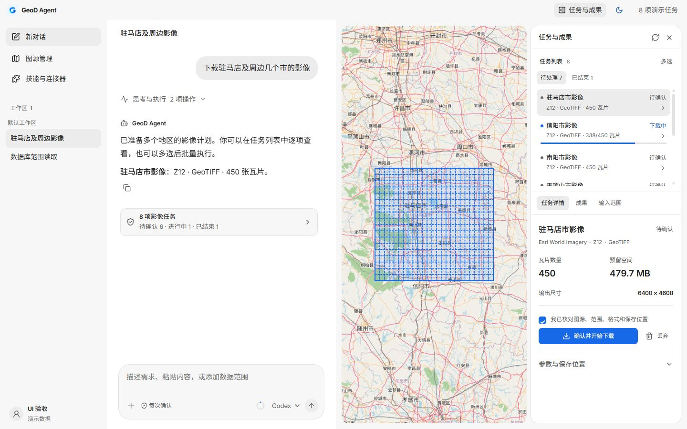
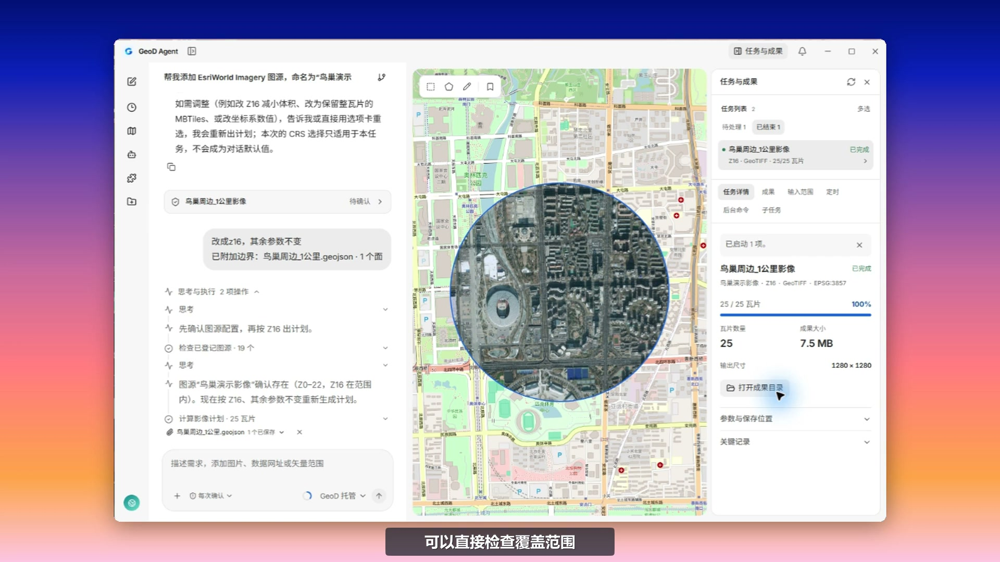
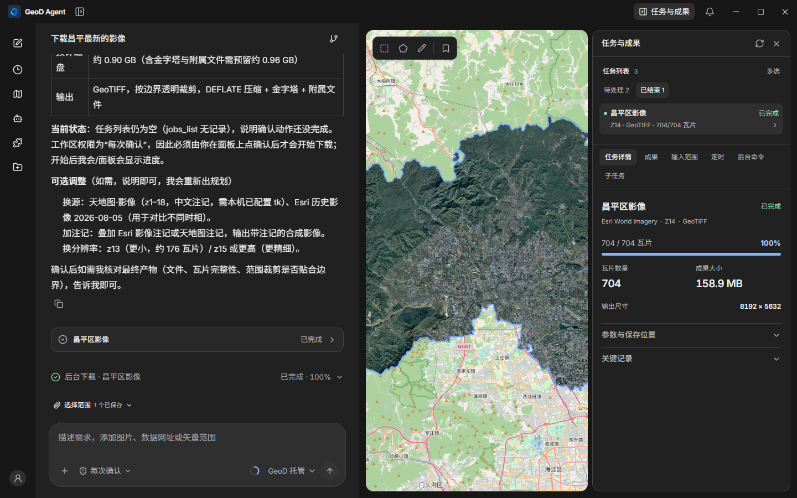
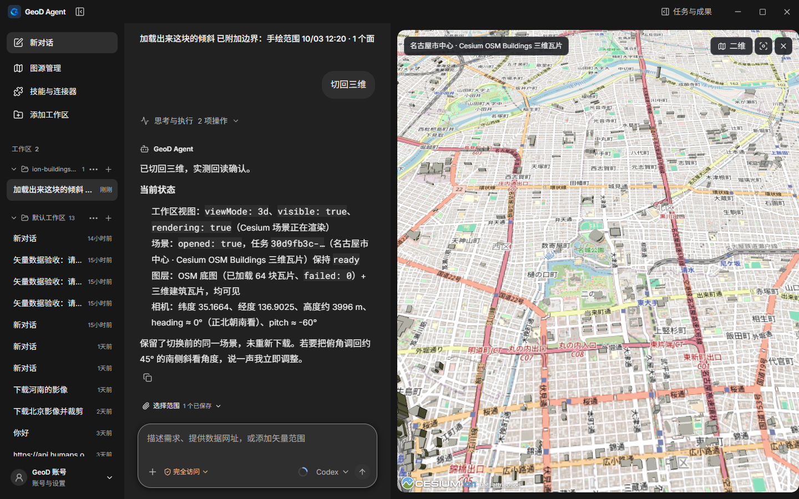

<h1 align="center">GeoD Agent</h1>

<strong>说出需求，把地理数据带回你的工作区。</strong>

对话规划 · 本机下载 · 二维 / 三维地图 · 可核验成果

<a href="https://geod.laogao.xyz/agent">官网</a> · <a href="#开始使用">开始使用</a> · <a href="docs/releases/0.2.4.md">0.2.4 候选说明</a> · <a href="README.EN.md">English</a>

*工作区界面预览，图中任务与进度为演示数据；下方影像与三维截图来自真实本机验证。*

GeoD Agent 是独立的 Windows 桌面应用。描述区域、数据类型和用途，核对图源、范围与输出参数，由你的电脑完成下载、拼接、裁剪和文件核验。模型负责理解需求与组织工具调用；影像瓦片不经 GeoD 模型服务器中转。

## 真实操作演示

**[点击观看完整视频](https://geod.laogao.xyz/agent#demo)** · [直接播放 / 下载 MP4](https://geod.laogao.xyz/geod-site/agent/geod-agent-demo-20261008-v6.mp4)

从空白会话开始，通过 AI 对话配置图源、准备 MCP 接入、确认输出参数、下载影像、查看成果并创建定时任务。中文配音与字幕；思考与等待加速呈现。视频为当前开发版实录，功能以实际安装版本为准。

## 版本状态

| 版本 | 状态 | 入口 |
| --- | --- | --- |
| **0.2.3** | Windows x64 公开测试版 | [下载安装包](https://geod.laogao.xyz/agent-updates/windows-x86_64/0.2.3/GeoD%20Agent_0.2.3_x64-setup.exe) · [版本说明](docs/releases/0.2.3.md) |
| **0.2.4** | 本地候选，尚未发布本次改进 | [本次候选说明](docs/releases/0.2.4.md) |

本页描述当前代码，包含 0.2.4 改进。现有公开安装包的功能以 0.2.3 说明为准。仓库当前为私有；[GitHub 发行资源](https://github.com/gaopengbin/geod-agent/releases/tag/v0.2.3)需要仓库访问权限。全新 Windows 验收仍按用户要求暂缓；本次提交与官网预览不等于发布。

## 开始使用

1. 安装当前测试版，使用 GeoD 账号在浏览器完成授权。
2. 配置数据图源。需要 Key / Token 的服务，在应用本机表单填写。
3. 描述需求，附上范围文件，或在地图上绘制边界。
4. 核对计划中的图源、范围、精度、格式、坐标系、预算与保存位置，然后执行。
5. 在任务区查看状态，加载成果到地图，打开成果目录并检查文件清单。

例如：

> 下载这份项目边界内的影像，输出 GeoTIFF，坐标系用 EPSG:4490。

> 查看这个区域的历史影像版本，让我先选择年份和时期。

> 加载三维成果，从南侧斜看建筑，然后切回二维地图。

参数不明确时先询问；明确要求不再询问时，在已授权范围内推进。待回答的选择卡保留在会话中；已确认参数可用于当前任务，只有明确指定才保存为会话默认。更改缩放等级时沿用原计划中已确认的坐标系。

## 数据工作流

| 数据 | 主要能力 | 成果 |
| --- | --- | --- |
| 影像 | XYZ / WMTS / ArcGIS ImageServer，注记合成，范围下载、拼接与裁剪 | GeoTIFF、MBTiles、PNG / JPEG、GeoPackage、原始瓦片 |
| DEM | Terrarium 解码，Float32 米制高程与 NoData | 高程 GeoTIFF |
| 历史影像 | Esri Wayback 目录、版本选择与区域元数据 | 历史影像与元数据 |
| 矢量 | OSM 要素、MVT / PBF，按范围筛选 | GeoJSON、GeoPackage、PBF、MBTiles |
| 三维 | URL / Cesium Ion / 认证服务，资源递归收集、离线核验与定位 | 3D Tiles 资源包与完整性清单 |

历史版本发布日期不等于拍摄日期。矢量范围筛选保留完整相交几何，3D Tiles 保留整块模型。图源连接成功不等于获得下载许可；覆盖、精度与授权需逐项核对。

### 从已有范围开始

地图矩形、多边形、行政边界与书签可直接用于任务。文件支持 GeoJSON、SHP / ZIP、GeoPackage、KML / KMZ、GML、FlatGeobuf、空间 SQLite 和 CSV WKT / EWKT；也可通过数据库或在线要素服务读取区域。所需格式引擎按需安装。

图源提供预设与自定义连接，支持已适配服务的查询参数认证、Bearer Token 和请求头。天地图等图源需要用户自己的有效凭据；密钥保存在本机凭据库，模型读取配置摘要。

## 一个工作区，连接对话、地图与成果

*2026-10-06 本机实际成果：昌平区影像，704 张瓦片，按行政边界裁剪后加载到地图。截图中的对话属于当时的验证记录。*

- **任务管理：** 下载、生成成果、核验分别显示状态；支持暂停、取消、恢复和缓存补漏。0.2.4 增加生成成果期间的持续反馈，默认不压缩，可直接打开成果目录。
- **多个区域：** 合并范围或按区域拆分计划，批量查看与管理任务。
- **定时任务：** 保存下载或 AI 指令模板，查看运行记录；是否自动执行取决于当前权限。退出窗口与停止后台是不同操作，定时运行需要本机后台继续运行。
- **持久化：** 工作区、会话、选择卡、任务账本与图源缩略图缓存在本机保存。
- **地图：** 内置 OpenLayers / Cesium 工具用于视野、图层、对象、底图与二维 / 三维切换。
- **会话：** 中英文界面、独立登录页、头像与昵称同步，执行过程可展开、停止和继续。超长思考限制高度；未完成轮次明确标记。

*真实模型验证：名古屋 OSM 建筑已加载，二维 / 三维切换及场景状态读回通过。*

## 0.2.4：GIS 按需安装

基础安装包移除 Java、Tika、Apache POI 和本地 OCR，GIS 原生依赖拆成五项技能，已下载的依赖共享复用：

| 技能 | 用途 |
| --- | --- |
| 多格式范围导入 | 检查图层、读取边界及坐标系 |
| 矢量转换 | 格式转换与重投影 |
| 矢量分析 | 裁剪、缓冲与几何简化 |
| 栅格检查 | 坐标系、波段、范围与基本统计 |
| 栅格转换 | 格式转换、重投影、压缩、COG 与金字塔 |

任务缺少所需技能时，显示安装提示，用户确认后下载并继续。支持离线组件目录；下载与解包文件按固定版本和 SHA-256 校验。基础包仍可使用 WGS84 GeoJSON、手绘范围、行政边界和瓦片下载拼接。

移除 OCR 后，扫描文档不会被自动当成已识别文本。旧 DOC / XLS / PPT 请先另存为现代格式。视觉模型的支持取决于所选渠道，扫描 PDF 自动拆页输入仍待完善。此前精简包的体积测量见[记录](docs/implementation/2026-10-06-slim-gis-skills.md)，不代表本次最终安装包大小。

## 模型与扩展

- **模型渠道：** GeoD 托管服务、自有 Key 和兼容中转网关；支持已适配的 OpenAI、Anthropic 与 Google 原生协议。不同渠道的模型、工具和视觉能力需实际验证。
- **Credits：** 模型用量依据实际收据记录与结算。当前测试服务首次启用钱包赠送 20,000 Credits；充值与真实收费尚未开放。自有渠道费用由对应提供方结算。
- **Skill：** 搜索目录、检查链接或导入本地包，保留指令、脚本与资料。安装 Skill 不代表其所有外部依赖都可用。
- **MCP：** HTTP / stdio 工具接入，认证请求头与浏览器 OAuth。首次启用确认与工作区文件权限分别管理；连接后列出真实工具与状态。
- **可选 RTK：** 对部分成功的本机命令输出做摘要，降低进入模型的冗余文本。原始执行记录保留；不改变命令、权限或退出码，也不承诺固定的 Token 或费用节省比例。

大段坐标、路线和矢量几何通过本机文件引用传递，模型优先读取范围、要素数与必要摘要。模型自己的思考文本与工具返回是不同来源，两者保留可追溯记录。

## 执行与数据边界

模型请求会发送任务描述及必要的工具信息到所选模型服务。图源凭据、下载瓦片和成果文件由本机管理；工作区写入、外部连接器启用和具体下载计划分别受权限检查。成果检查记录实际文件、大小、哈希与缺失覆盖，模型说“完成”不能代替任务状态和文件核验。

GeoD Agent 与[旧 GeoD 桌面端 / CLI / MCP](https://github.com/gaopengbin/geo-downloader)、GeoD Global 分别维护。当前运行时没有指向旧仓库的路径依赖。

## 开发与验证

| 目录 | 内容 |
| --- | --- |
| <code>apps/geod-agent-desktop</code> | React / Tauri 桌面应用、场景桥接与本机执行 |
| <code>crates/geod-core</code> | 格网、下载与成果处理 |
| <code>crates/geod-task-engine</code> | 确定性计划、批准与 SQLite 任务账本 |
| <code>crates/geod-vector</code> | 矢量工作流 |
| <code>services/geod-agent-model-gateway</code> | 模型协议、账号用量与托管网关 |
| <code>contracts</code> | 有版本的任务与工具合同 |
| <code>docs/implementation</code> | 真实验证证据、限制和恢复记录 |

固定运行时准备与启动说明见[独立开发入口](docs/implementation/2026-10-06-independent-development-host.md)。前端使用 Vite 热更新；发布准备会校验固定版本运行时与许可证。不要把测试图源、模拟任务或本地预览当成线上验收。

### 文档导航

- [0.2.4 本次候选与验证范围](docs/releases/0.2.4.md)
- [功能清单与验收记录](docs/implementation/2026-10-03-functional-roadmap.md)
- [GIS 技能拆分](docs/implementation/2026-10-06-slim-gis-skills.md)
- [坐标系与仅修改缩放等级](docs/implementation/2026-10-07-imagery-zoom-revision.md)
- [问答卡历史](docs/implementation/2026-10-07-user-input-history.md)
- [模型输入中的大段坐标处理](docs/implementation/2026-10-07-bulk-coordinate-data.md)
- [架构设计](docs/design/geod-agent-desktop-technical-architecture.md) · [产品边界](docs/REPOSITORY_BOUNDARY.md)

反馈时请附上版本、图源类型、任务状态与脱敏日志；不要在会话或 Issue 中粘贴 Key、Token、密码或私钥。
