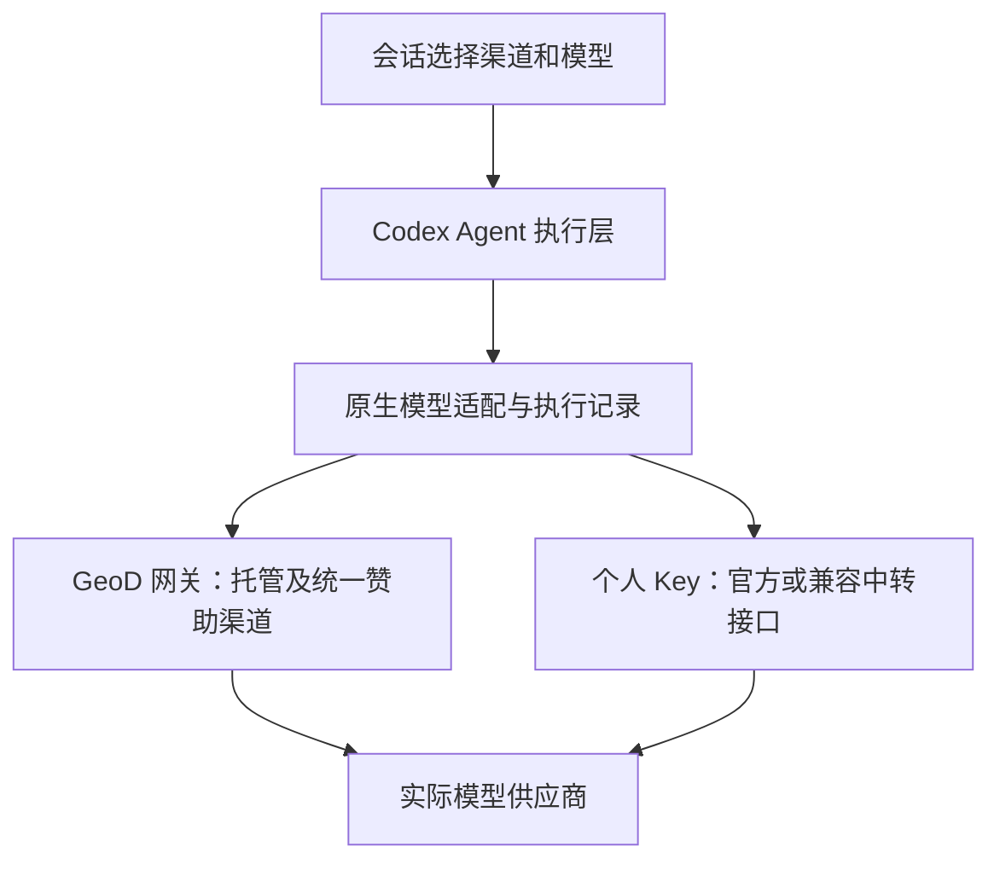

# 多渠道 AI、BYOK 与赞助接入方案

2026-10-04 更新：原生 BYOK、页内渠道管理、会话选择与真实子任务/定时渠道快照已接入并验收，详见 [原生接入报告](../implementation/2026-10-04-ai-channels-integration.md)。下文保留 2026-10-03 的方案与当时状态。

日期：2026-10-03。状态：已核对扩展方案并完成隔离协议候选验证，尚未启用应用内多渠道配置或用户 BYOK。0.2.0 安装候选没有重打包。

后续进展：已完成两种协议的隔离接入候选和真实模型验证，详见 [AI 渠道接入验证](../implementation/2026-10-03-ai-channels-verification.md)。应用内渠道配置与选择仍待接入；安装候选没有重打包。

## 当前实现

- 默认使用 GeoD 账号和托管模型，供应商 Key 在服务端。该默认方式延续已有产品选择。
- `services/geod-agent-model-gateway/server.mjs` 的配置只允许 DeepSeek 官方地址或本机测试地址，模型限定为两个 DeepSeek 标识；不是任意中转地址和模型都可以直接填写。
- `apps/geod-agent-desktop/src-tauri/codex-host.mjs` 固定使用 `geod_hosted`，Codex 请求先进入本机 Responses 桥接，再经原生层交给 GeoD 网关。普通聊天、子任务和后台定时执行均依赖该托管能力入口。
- 当前版本没有用户管理多个渠道、自填模型 Key、供应方标识或赞助渠道用量分账的界面。

Codex 的模型供应商配置支持自定义地址、环境凭据和请求头；当前官方配置中 `wire_api` 为 Responses。因此 GeoD 可以扩展模型渠道，保留现有 Agent 执行层。仅提供 Chat Completions 的接口，需要 GeoD 适配器保留完整工具与事件语义。[官方自定义供应商配置](https://learn.chatgpt.com/docs/config-file/config-advanced#custom-model-providers)、[配置字段](https://learn.chatgpt.com/docs/config-file/config-reference)。这是接入依据，不代表已验证任意供应商。

## 三种使用方式

| 方式 | 用户如何使用 | Key 保存位置 | 用量归属 |
| --- | --- | --- | --- |
| GeoD 托管 | 默认入口，选可用模型即可 | GeoD 服务端 | GeoD 托管渠道账本 |
| BYOK，自带 Key | 填服务地址、Key、模型；可配置官方接口或兼容中转站 | 本机系统凭据库 | 单独记录本机渠道用量，建议不重复扣 GeoD 模型余额 |
| 合作/赞助渠道 | 选择“某供应方赞助”，可支持合作方提供的独立兑换凭据 | 统一赞助 Key 在 GeoD 服务端；个人凭据在本机 | 赞助渠道独立账本，按实际合作额度和供应方记录核对 |

多渠道指可以保存、选择多个模型服务。首版按会话选择渠道/模型；是否进一步让不同子任务使用不同模型，是后续独立功能。

建议优先打通两类协议：

1. OpenAI Responses 兼容接口。
2. OpenAI Chat Completions 兼容接口，通过 GeoD 适配器驱动 Codex。

Anthropic Messages、Gemini 原生接口可以保留适配器扩展位置，首版不能宣称已经支持。供应方开放的模型 ID 当作配置数据处理，避免继续写死品牌和模型白名单。

## 应用界面

账号菜单增加“模型与渠道”，进入页内设置，延续现有 Agent 应用风格。

- 渠道列表：名称、类型、服务地址、已验证的模型、连接状态、启停与默认选项。
- 添加/编辑：供应商预设或自定义地址、协议、Key、模型列表；可读取模型目录，也允许目录不可用时手工填写模型 ID。
- 输入框：现有模型选择器展示“渠道 / 模型”；合作渠道增加小型“赞助”标识。
- 运行记录：保存本次使用的渠道、模型、用量及计费归属。
- 供应方介绍：在渠道详情显示名称、官方网站、合作说明和可用额度。展示方式与合作方另行确认，不制造虚假合作关系。

输入 Key 时临时传给原生层，保存后清空输入；读取配置仅返回已配置状态，不回传原 Key。密钥不进入浏览器持久存储、模型消息、日志或可发布候选。

## 实现结构

统一渠道配置应包含：稳定渠道 ID、名称、模式、协议、服务地址、凭据引用、模型列表、各模型能力、启用状态、供应方信息与计费归属。

实现重点：

- 从现有 DeepSeek 实现提取协议适配器；额外参数、思考项、工具名称、工具结果、图片和用量字段按协议处理。
- 每次运行固定渠道配置快照。主对话、子任务、后台命令所属 AI 和定时任务都保存所属渠道/模型，重开或改默认渠道不会悄悄改变正在执行的任务。
- 现有本机操作继续使用 GeoD 账号归属隔离；BYOK 是模型请求的接入方式，纯本机免登录身份另行设计。
- 个人 Key 请求由本机原生层发送；统一赞助 Key 由 GeoD 服务端使用。服务端赞助地址由运营配置，不让普通请求任意改动服务器目标。
- 用量保存 `channelId`、实际模型、输入/输出/缓存用量、上游请求 ID 和计费归属。缓存数据缺失时标记未知，不套用当前 DeepSeek 固定费率推算所有供应商。
- 超时后的请求继续采用结果核对机制；渠道切换不能让工具操作重复执行。跨渠道回退须由用户设置，并明确费用归属。

## 赞助合作可以提供什么

合作方案可以包括：

- 一键选择合作渠道、供应方名称与链接展示。
- 接入赞助额度或合作方的个人 Key，支持其指定模型。
- 区分赞助用量与 GeoD 自营用量，提供按渠道的聚合使用报告。
- 用真实 Agent 工具循环展示地理数据读取、下载、地图与三维操作场景。

统一赞助 Key 不能打包给桌面用户。合作报告默认使用聚合请求量、token 和成功/失败统计；不包含用户对话、工作区文件内容或个人 Key。具体曝光位置、额度和报告口径须与合作方约定。

申请合作时可说明“正在建设多渠道接入，具备真实 Agent 工具链和可测试桌面候选”；在第一家渠道通过验收前，不写成“已经兼容所有中转站”。

## 实施顺序与通过条件

1. 渠道配置与凭据保存，保留现有托管入口作为默认。
2. 本机 BYOK 两类协议适配，完成页内配置与模型选择。
3. 同一配置贯穿对话、子任务和后台定时执行。
4. 服务端统一赞助路由、品牌信息和分开用量。

每个接入渠道至少验证：模型目录或手工选择、真实流式回答、模型工具调用→原生执行→工具结果→模型最终回答、取消/错误、重开恢复；声明支持图片时另测图片输入。再验证子任务和无窗口定时 AI 的渠道归属。官方将工具调用定义为多步请求与工具结果往返，单次聊天成功不足以完成该验收。[工具调用流程](https://developers.openai.com/api/docs/guides/function-calling#the-tool-calling-flow)

用户当前没有指定赞助方地址或模型 Key。本轮完成的是现状核对与方案，不进行外部渠道配置、收费、发布或联系赞助方。
