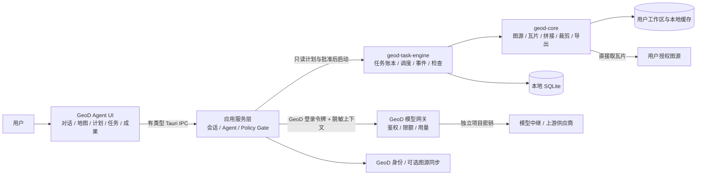
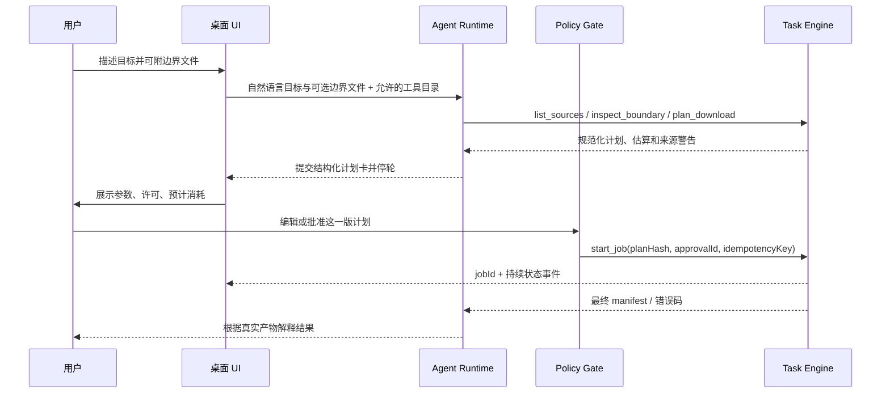

# GeoD Agent 桌面端技术架构

日期：2026-09-27，模型方案与独立仓库边界更新于 2026-09-28。状态：实施设计；当前代码与验收进展见[桌面与网关实施记录](../implementation/2026-09-28-desktop-and-gateway.md)。对应[产品方案](geod-agent-desktop-product-2026-09-27.md)与[仓库边界](../REPOSITORY_BOUNDARY.md)。本仓库只承载国内 GeoD Agent；既有 GeoD 和 GeoD Global 各自维护代码与发布渠道。

## 1. 约束与现状

- 首发是**独立安装的 Windows x64 应用**，用户设备承担瓦片下载、拼接、裁剪和文件检查。GeoD 服务端承担账号、托管模型及用量账本、可选图源同步，不代理影像瓦片或代跑任务。
- 首条完整能力是自然语言描述任务和可选的边界文件 → Agent 读取已授权图源并追问缺项 → 确定性估算 → 用户核对并批准计划 → 本地下载 → 裁剪/离线包 → 实际成果检查。MapLibre 地图使用 OSM 交互底图展示计划范围和本地核验影像，不提供常驻手动任务参数表单。OSM 底图与未来的 OSM 数据任务是两种独立能力；DEM、OSM 数据、Wayback、3D Tiles 在各自适配器完成真实验收后加入。
- 上游 [`geo-downloader` 的 `0938626`](https://github.com/gaopengbin/geo-downloader/tree/0938626) 中，桌面 `src-tauri/src/commands.rs` 有下载、资源估算与恢复逻辑；`task.rs` 同时持有内存任务状态和持久化任务文件，`history.rs` 只存完成/失败历史。Agent 不能直接把这些命令当成可持久化的工具 API。
- 上游 `crates/geod-core/src/lib.rs` 用 `#[path]` 引用 `src-tauri/src` 的实现；`pipeline.rs` 的有界 `plan/fetch/inspect` 与 manifest 比桌面下载能力窄。须整理独立核心库的源码所有权和版本，再将经验证的能力迁入本仓库。旧桌面与 CLI/MCP 的适配在原仓库分别完成，不用跨仓本地路径依赖。
- 现有桌面 `assistant.rs` 是 DeepSeek 自带 Key 的问答/导航助手，没有行动工具循环。新 Agent 的执行与状态不能从聊天文本推断。
- 用户提供的 SpatialMind 逆向报告提示了结构化计划、长任务与成果核验的工程价值；没有随报告附上原始拆包产物。本设计借鉴机制，不把报告里的具体内部版本或实现当作已验证约束。

## 2. 选型决定

| 决定 | 首发选择 | 理由与边界 |
| --- | --- | --- |
| 桌面壳 | 独立 **Tauri 2** 应用、独立 App ID/安装包/更新通道 | 与现有 Rust 下载实现衔接；不为 Agent 再维护 Electron + Python 双运行时。旧桌面不被替换。 |
| UI | **React + TypeScript + Vite**；beUI Button、Radix Dialog/Select、Lucide 与 MapLibre | 左侧本机对话列表、中间对话与地图、右侧可展开成果页；蓝白亮色与黑色暗色。OSM 官方瓦片只按视窗读取并缓存至少 7 天，桌面端设置 GeoD User-Agent 和 Windows 用户代理；本地影像作为独立地理图层。组件交互底层与 GeoD 品牌样式分离。 |
| 业务内核 | `geod-core` 负责图源/区域/瓦片/导出纯能力；新增 `geod-task-engine` 负责计划、持久任务、检查和事件 | Tauri 命令只做 IPC 适配，确定性计算不依赖窗口。首发不开本地 HTTP 网关。 |
| Agent 编排 | 目标是 Rust 内的受控工具循环，模型适配器支持 OpenAI 兼容工具调用 | 当前原型的工具续答循环位于 React，Tauri 命令仍校验每项计划与执行操作；迁入 Rust 是尚未完成的架构工作。任务类型少且安全边界明确，暂不引入任意 shell。 |
| 本地数据 | SQLite WAL + 版本化 schema；每条计划自动建议独立的本机成果目录并在审批卡展示 | 任务/审批/事件必须在崩溃后可恢复；大文件不放数据库。 |
| 模型 | **GeoD 托管模型为新 Agent 的默认且首发必备路径**；客户端只与 GeoD 模型网关通信 | 用户登录后可直接使用。供应商路由和密钥留在服务端，模型只负责理解与提出工具调用。旧桌面自带 Key 逻辑不迁入新产品入门流程。 |
| 外部 Agent | 现有 CLI/MCP 保持独立发布；以后适配相同任务合同 | 本地 MCP 不是核心进程内部通信的必需层，也不能因为同名工具就宣称功能对齐。 |

## 3. 部署与模块边界



依赖方向只能从 UI → 应用服务 → 任务引擎 → 核心能力。`geod-core` 和 `geod-task-engine` 不引入 Tauri、React、GeoStyle 服务或产品域名。账号/模型是端口适配器；下载引擎不直接依赖登录页面或模型供应商。

当前代码中的模型工具续答由 React 维护，因此尚未完全达到上述依赖方向。已有本机工具白名单和 Tauri 侧的计划/批准校验，后续需把会话续答与工具调度迁入 Rust 应用服务层，并以真实模型完成端到端验收。

本独立仓库建议目录（实施时可按构建验证微调）：

```text
apps/geod-agent-desktop/       # 独立 Tauri 配置、React UI、IPC 适配
crates/geod-core/              # 经来源与兼容审查迁入的纯下载/导出实现
crates/geod-task-engine/       # TaskSpec/Plan/Job/Artifact、SQLite、恢复与事件
services/geod-agent-model-gateway/ # GeoD 账号模型鉴权、配额、用量及上游路由
contracts/                     # 版本化 schema 与跨产品兼容样本
docs/                          # 产品、架构、仓库边界与验收记录
```

旧桌面、CLI 和 MCP 不搬入本仓库。共享能力通过有版本的发布产物或合同衔接；不使用 `../tif-downloader`、开发机绝对路径、符号链接或 `file:` 依赖。任何迁入的源码须保留来源、许可与改动记录。

应用内不启动监听 `0.0.0.0` 的服务。Tauri IPC 只导出白名单命令；渲染进程不能读模型 Key、GeoD refresh token、图源密钥或任意本机文件。未来如需让外部 Agent 控制**当前桌面任务**，另设计仅本机可达、按客户端授权的 IPC/协议与进程锁，不能把远程 MCP 地址等同于本机执行权。

## 4. 领域合同与版本

合同用 Rust `serde` 定义，生成/验证 JSON Schema 与 TypeScript 类型；所有输入 `deny_unknown_fields`、`schemaVersion` 显式标记，API 变更有兼容测试。坐标统一使用 WGS84 `[west,south,east,north]`；多边形明确 CRS、环方向、洞与反经线拆分规则。Area、Source、Output 的字段不能由模型以自然语言越过验证器。

| 合同 | 必需信息 | 所有者 |
| --- | --- | --- |
| `TaskSpec v1` | 请求类型、图源 ID、区域几何及 CRS、级别集合、裁剪、输出格式/目录、压缩/金字塔选项、用户选择的限额 | 应用服务接收，内核校验 |
| `SourceDescriptor v1` | 来源、署名/许可、URL 模板的密钥引用、XYZ/TMS、像素尺寸、覆盖级别、请求速率/并发 | 本地图源仓库；敏感模板不送模型 |
| `Plan v1` | 规范化 spec、图源配置指纹、真实瓦片网格、总量/磁盘/网络估算、警告、失效时间、`planHash` | 任务引擎生成；不可由模型伪造 |
| `Approval v1` | 用户 ID/本机主体、`planHash`、批准时间、操作范围、确认界面版本 | Policy Gate 本地事务保存 |
| `Job v1` | `jobId`、`planHash`、幂等键、状态、执行检查点、事件序号、错误码 | 任务引擎为唯一写入者 |
| `ArtifactManifest` | 每项成果的相对路径、类型、大小、SHA-256、CRS、足迹、来源、质量与缺块 | 引擎在文件检查后最后发布 |

现有 CLI bundle `manifest.json` 是 `schemaVersion=1.0`、`kind=geod-bundle`。新增字段优先**向后兼容**；若必须改变语义则发布 v2 及显式迁移器，不能静默破坏 CLI/MCP 的 `inspect`。现有源码里“GeoStyle artifact contract”的注释不代表新产品依赖 GeoStyle；迁移时改成 GeoD 自有合同说明。

`planHash = SHA-256(canonical TaskSpec + source fingerprint + relevant policy version)`；输出目录已在 `TaskSpec` 中。图源指纹使用非敏感配置及凭据**引用版本**，绝不把原始密钥写入哈希输入或日志。规范化必须先固定数字精度、数组顺序、空值和字符串编码；修改范围、图源、级别、格式或目录后旧批准失效。`start_job(planId, planHash, approvalId, idempotencyKey)` 在一个数据库事务中校验批准和唯一键，然后才调度 I/O。重复调用只返回原 `jobId`；模型断线/重试不能创建第二个任务。API 返回有类型错误码及中文可读消息。

桌面 IPC 的第一版表面必须小且稳定；UI 不直接调用 `geod-core` 的底层函数：

| IPC 操作 | 请求/响应的要点 | 副作用 |
| --- | --- | --- |
| `sources.list`、`sources.probe` | 仅返回展示元数据与经过脱敏的探测结果 | `probe` 只取用户确认的一小块样本 |
| `plans.create`、`plans.get` | `TaskSpec` → `Plan`、警告及 `planHash` | 写草稿，不下载 |
| `approvals.grant` | `planId` + `planHash` + UI 确认主体 → `approvalId` | 写一次性批准记录 |
| `jobs.start` | `planId` + `approvalId` + 幂等键 → `jobId` | 校验后入队 |
| `jobs.get`、`jobs.events` | 当前快照；`afterSeq` 补读有序事件 | 只读 |
| `jobs.pause/resume/cancel` | `jobId` + 预期状态版本 → 新状态或冲突码 | 受控状态迁移 |
| `artifacts.inspect/open` | 已登记 `artifactId` → 检查结果/用户发起的打开动作 | 不接受模型给出的任意路径 |

通用错误信封为 `{code, message, retryable, details?, correlationId}`。首批稳定码包括 `INVALID_SPEC`、`PLAN_STALE`、`APPROVAL_REQUIRED`、`POLICY_DENIED`、`SOURCE_UNAUTHORIZED`、`SOURCE_RATE_LIMITED`、`DISK_INSUFFICIENT`、`OUTPUT_CONFLICT`、`JOB_STATE_CONFLICT`、`ARTIFACT_INCOMPLETE`、`MODEL_TOOL_MALFORMED`。`details` 只含可安全展示的字段；UI 根据码提供编辑计划、重新授权、换目录、稍后重试或检查缺块的动作。内部异常不能全压成“网络错误”。

图源适配器首发区分 256/512 像素瓦片、XYZ/TMS、图片格式及响应 `Content-Type`。512 源只有在估算、拼接、地理参考与裁剪完整贯通并有真实样本验收后才开放，不用“仅允许 256”隐藏能力缺口。图源 HTTPS、域名、重定向、私网地址和下载许可均在本地策略检查；企业内网源需用户显式登记为可信。

## 5. Agent 工具循环与审批



- **只读工具**：`list_sources`、`inspect_boundary`、`resolve_area`、`plan_download`、`estimate_resources`、`job_status`、`inspect_artifact`。这些可自动调用；地址解析的候选范围仍须由用户选择或可证明唯一。
- **需确认工具**：`save_source`、`start_job`、`change_output`、覆盖文件、删除成果。用户在界面上批准确定的对象；模型文字中的“已确认”无效。暂停/恢复/取消需核对任务所有权和当前状态；当次明确授权可减少重复弹窗。
- 模型输出严格匹配工具名与 schema，工具结果只返回模型需要的摘要。最多一次参数修复；不完整或孤立 tool call 写诊断事件。副作用工具在重试前**先查幂等账本**。禁止任意 shell、网页控制、任意路径读写及向图源 URL 注入参数。
- 结构化计划卡来自内核 JSON，不解析模型自由文本里的伪 JSON/代码块。模型可以解释、建议或询问，但不能把一个工具调用的失败改写为“下载完成”。
- 缺项由 Agent 在对话中追问；用户要求修改时重新调用计划工具并得到新哈希。地图只预览范围，不能让模型在旧计划上继续执行。

## 6. 长任务、恢复与成果

SQLite schema 至少含 `plans`、`approvals`、`jobs`、`job_events`、`tile_checkpoints`、`artifacts`、`conversations`、`schema_migrations`；按 `jobId`、幂等键和事件序号建唯一索引。`job_events` 是可重放的事实流，前端进度订阅可掉线后按序号补读。WAL 只保证数据库事务，不替代输出文件的原子发布。

事件信封统一为 `{jobId, seq, occurredAt, type, stage, progress?, payload}`。进度事件可合并，但状态迁移、用户批准、来源错误和成果发布必须保留。UI 订阅中断后先读快照与 `afterSeq`，再接实时流，避免漏掉完成事件。数据库迁移前做备份；应用遇到比自身更新的 schema 时拒绝写入并提示升级，不让旧版安装包破坏新账本。

状态：`draft → needs_input → planned → awaiting_approval → queued → downloading → processing → verifying → completed | partial | failed | cancelled`；暂停保持原阶段及检查点。状态迁移由引擎校验，不接受前端或模型直接写 `completed`。`partial` 要列缺失瓦片及可用成果；真正失败也保留诊断和可恢复缓存。

每个任务只写自己的 staging 目录；瓦片检查点记录坐标、来源配置指纹、响应状态、字节数/校验及重试计数。下载有来源级并发、速率、退避及暂停/取消信号，403/429、坏瓦片、磁盘不足和断网分别返回可操作错误。恢复时扫描数据库与 staging、核对真实文件和图源指纹，跳过已验收瓦片并补缺；不以 UI 百分比推断完成。`jobId` 与目标路径持有本机排他锁，避免旧桌面、CLI/MCP 和 Agent 同时覆盖一个输出。

处理完成后重新打开影像与离线包，校验文件可读性、尺寸、地理参考、裁剪 alpha、足迹、缺块和哈希；将 manifest 作为**最后一步**写到临时文件并原子替换。数据库终态只在 manifest 与文件检查通过后提交。崩溃在文件发布与数据库提交之间时，启动恢复流程重验文件后补记状态，不能重复下载或宣称未检查的成果已交付。

独立应用数据目录只放会话、数据库、日志、凭据引用和可再生缓存；成果默认写入每条计划自动建议、在批准卡展示的本机独立目录。卸载默认保留成果与旧版 GeoD 数据。迁移和清理均限制在有产品标记的绝对目录中，先展示可删除内容，避免按推算路径递归清理。

## 7. 账号、托管模型与信任边界

- GeoD 账号使用现有身份体系；桌面端需增设经服务端注册/验收的原生客户端 OAuth Authorization Code + PKCE 回跳。若当前身份服务尚无该能力，登录作为独立接口工作包实现，不能拿 MCP 令牌或网站 Cookie 临时代替。托管模型请求需独立的 `geod:agent` 权限；登出和会话撤销后不再接受新模型请求。
- 桌面端的 refresh token 与图源密钥存操作系统凭据库；数据库只存引用 ID 与非敏感元数据。渲染进程通过窄 IPC 请求动作，不接收原始密钥。供应商密钥**只在服务端**，不能通过 Tauri IPC、日志、更新包或模型上下文送到客户端。
- GeoD 模型网关使用账号令牌识别用户，检查模型调用额度、并发与请求大小，限制可用模型/工具合同版本，再用该产品专用的下游密钥调用 New API。New API 是计划中的项目上游路由；上线前须核验实际可用模型、工具调用表现与费用。网关不直连 Metapi，也不从客户端接收上游密钥。GeoD 网关与 New API 之间使用私有网络或加密通道，不能把公开明文 HTTP 当作生产链路。
- 本地任务与模型会话分离：网络断开或 GeoD 会话短时失效时，已批准且已启动的本地下载可按原计划继续；新的 AI 轮次暂停并引导重新登录。若任务依赖过期的 GeoD 付费权益，启动前需重新核验，不在瓦片循环中临时改变既定计划。
- 上游 `geo-downloader/services/ai-gateway` 当前仅是问答/导航的开发网关，使用静态 `GATEWAY_TOKEN` 和进程内限流，原 README 明确要求上线前加持久额度。它可提供知识检索参考，**不能原样成为多用户计费网关**。新服务需按 GeoD 用户做持久配额、用量账本与密钥隔离；旧桌面助手的自带 Key 设置保持原状。
- 每次生成使用客户端 `generationId` 作为幂等键。网关在持久事务里检查账号状态与余额、预留本次上限、发送上游请求、流式转发工具调用/文本、记录上游实际 usage 后结算并释放余量。连接断开或客户端重试先查询原 generation；不能再次扣减或重复创建本地下载。上游无可靠 usage 时标记待对账，不伪造精确费用；失败、超时和取消要有可解释的结算规则与对账任务。
- GeoD 账单与上游模型消耗分开：用户看到 GeoD 用量明细、余额变动及请求 ID，后台可用 New API/供应商 usage 核对成本。免费额度、付费单价、充值与退款口径在公开发布前确定，不能把账号积分与第三方图源的付费额度混算。模型默认路由的切换须先通过工具调用回归；同一次未完成的本地任务不能因为模型切换重放有副作用的工具。
- 模型网关默认不保存原始对话、地图文件或成果影像；最小化保留 userId、generationId、模型/路由版本、token usage、费用和错误码。诊断内容须单独征得用户同意。聊天会话在本机保存；上传给模型的是范围、图源展示名、计划摘要及经过裁剪的工具结果，不包含完整 URL/请求头、绝对路径或原始日志。
- 账号规则与来源许可分开：登录不能赋予用户第三方图源的下载权。新 Agent 是否执行“匿名最多 5 级”仍待产品决定；当前已批准范围仅 CLI、MCP、浏览器，不改变既有桌面版。若对新 Agent 启用，客户端需给出易懂拦截和授权入口，服务端权益校验只用于 GeoD 自有付费/配额能力。托管 AI 对话要求 GeoD 登录；是否提供匿名试用另议，不能以匿名请求无限消耗服务端模型额度。
- 外部文档、图源元数据、瓦片响应和模型回复都按不可信数据处理；不接受其中的“执行命令”“跳过批准”等文字为指令。预览协议仅允许已登记成果的相对路径，防路径穿越；日志与遥测脱敏。

### 托管模型接口与账本的最小合同

| 服务端接口 | 合同 |
| --- | --- |
| `POST /api/agent/generations` | GeoD Bearer 令牌；`generationId`、`conversationId`、`toolsetVersion`、裁剪后的消息、输出上限；返回有序 SSE 文本/工具调用事件。相同用户 + `generationId` 重试返回原生成状态，不再次提交上游。 |
| `GET /api/agent/generations/{id}` | 查询 `reserved/streaming/settled/failed/pending_reconcile`、使用量和可恢复事件位置；不能查其他用户的请求。 |
| `GET /api/agent/usage` | 返回当前额度、冻结预留、已结算用量及按 `generationId` 可查的明细；金额与 token 分开显示。 |

服务端至少有 `model_generations`、`usage_ledger`、`quota_policy_versions`、`reconciliation_runs` 持久表。`usage_ledger` 使用追加记录和唯一外部请求 ID，不靠覆盖余额数字解释扣减历史；余额投影可重建。生成开始前在事务内预留上限，结束后按上游实际 usage 结算并释放未用部分。若上游请求已发出但服务端在记账前崩溃，恢复任务在上游支持请求查询时依据其 ID 重查；否则保持 `pending_reconcile` 并由运营对账，不能盲目再次计费或标成免费。模型网关只返回建议和工具调用，**不执行本地 GeoD 工具**；桌面端仍持有计划审批和作业幂等账本。

## 8. 打包、运行与可观察性

首发安装包包含完成影像闭环所需的原生能力，不要求用户手装 Node、Python、GDAL 或 CLI。确实重且非首发的数据类型将来使用按需能力包，需签名/哈希验证、版本兼容矩阵、失败回滚、空间预算及独立用户数据目录；不先建空的应用市场。旧 GeoD 与 Agent 使用不同 App ID、安装路径、数据目录和更新通道，允许并存。

本仓库从零建立 Cargo/前端构建配置。新 Tauri 应用可用仓库**内部**路径依赖接入本仓库的 Rust crate；每个可发行程序的锁文件都纳入版本控制和干净机 CI。不得依赖旧仓库或本机绝对路径。待依赖树、Windows 原生库及安装器通过重复构建后，再评估统一 workspace，不能为目录整齐而引入不可复现的构建。

日志以 `sessionId/jobId/planHash` 关联模型工具、审批和执行事件；默认不记录密钥、原始图源 URL 或用户完整路径。诊断页显示模型、身份、来源和磁盘四类故障的位置及下一步，避免把所有失败写成“网络连接失败”。埋点分清计划产生、用户批准、任务启动、文件验证、成功/部分成功；上传前遵循现有隐私设置。

可观测但不伪造的指标：应用冷启动到可交互、计划生成时间、每来源瓦片成功率、任务恢复成功率、各阶段耗时、工具调用合法率、最终 manifest 检查通过率。上线阈值以干净机器及真实任务基线测定，不能照抄竞品报告的启动数字。

## 9. 迁移顺序与验收

1. **合同与基线**：固定旧桌面、CLI/MCP 的真实输入/输出样本；写 `TaskSpec/Plan/JobEvent/Manifest` schema 和适配测试。明确既有 SQLite/任务文件的读取范围、版本与备份路径。
2. **迁入核心能力**：在上游固定版本上识别 `config/tile/downloader/merger/exporter/clip` 等纯逻辑，记录来源与许可，整理后迁入本仓库的 `geod-core`，删除反向 `#[path]`。本仓库先用旧产品样本做行为兼容测试；旧桌面是否升级到相同合同由原仓库单独实施与回归。
3. **任务引擎纵切**：实现 SQLite 账本、计划哈希、审批、幂等启动、事件补读与崩溃恢复。用合法图源做一条无模型的真实影像任务，检查 GeoTIFF、离线包、manifest 和可视足迹。
4. **账号与托管模型纵切**：建立桌面 OAuth 客户端、GeoD 多用户模型网关、产品专用 New API 密钥、持久额度/用量/对账账本；先用受限账号验证一次流式 `tool_call → tool_result → final` 与断流结算。
5. **独立桌面与 Agent**：Tauri 壳、beUI 组件验证、常驻对话/地图预览/任务三栏、本地图源授权、对话追问与计划批准；用托管模型测试断线、重复调用、错误工具输出和用户要求修改计划，验证新旧程序并存和卸载保留用户成果。
6. **扩展适配器**：逐个接 DEM、OSM、Wayback、3D Tiles；CLI/MCP 逐步对齐可证明的共享合同，不在首发承诺全部桌面能力。

模型评测固定一组可重放的中文任务：区域/图源缺参、边界带洞、无权图源、超预算、用户修改计划、下载半途断线、工具返回不完整、重复 `start_job`、已有成果复检。记录工具选择、计划参数、批准次数、实际文件和错误恢复；评测按确定性任务事实判分，不以回答是否流畅替代成功率。

放行门槛：干净 Windows x64 安装；GeoD 登录后无需填写模型 Key 即可完成真实工具调用；托管模型的账户限额、重复请求、断流结算及上游对账通过；至少一个允许批量下载的真实图源完成端到端；512 像素源若宣称支持须有单独端到端样本；未登录/登录及失效凭据分支清楚；同幂等键重复调用仅一个任务；断网/403/429/磁盘不足/崩溃重启/缺块/取消均有真实状态；成果重新打开与哈希检查通过；抓包证明瓦片不经 GeoD 服务器；旧桌面和 CLI/MCP 回归不退化。

## 10. 待确定但可并行推进

1. GeoD 身份服务的原生应用 OAuth 客户端、会话撤销和图源同步 API 的实际接口，需要服务端对接审查。
2. **托管模型已确定。** 默认模型、免费额度、付费单价、异常请求结算、充值/退款及权益展示仍待真实路由与成本验证；任务引擎与网关用版本化 policy 接口实现。新 Agent 的匿名下载级别是否沿用 CLI/MCP/浏览器规则另行定稿。
3. beUI 组件包与授权、地图底层是否迁移到纯 MapLibre，需要通过小型交互样机验证性能与许可。
4. 旧桌面的任务文件、历史 DB 与新 Agent 账本是否共享：首发建议**不共享数据库**，只支持显式导入已完成 bundle；无损迁移方案经真实用户样本验证后再决定。

本方案的首条影像链和 Windows 安装包已在本地实现，未发布；真实账号与托管模型联调及其余能力包仍待验收。当前使用 `0.1` 预发布合同；本节的 v1 合同与其余路径需在对应工作包完成。
