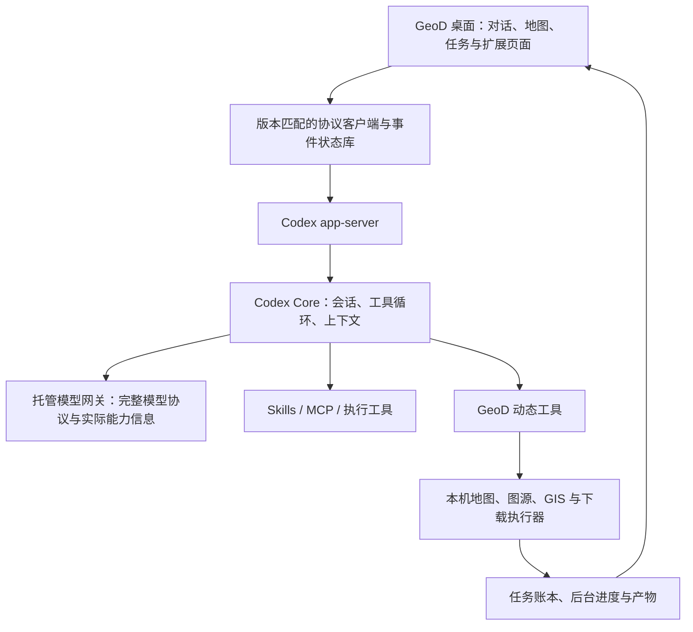

# Codex 开源体系与 GeoD 接入评估

日期：2026-10-01。范围：官方 OpenAI Docs、已有 Codex 源码快照、实际安装的 0.159.2 协议、当前 GeoD 仓库代码。

## 1. 判断

**继续采用 Codex 作为 GeoD 的 Agent 运行核心。当前接入已使用真实 app-server，但仍是受限的第一版适配，尚未完整利用其能力。**

主要缺口集中在模型协议、指令传递、上下文、事件展示和扩展接入。单独更换一个 SDK，或继续添加提示词，都不能补齐这些缺口。推荐使用发布版运行时与版本匹配的协议，先补适配；暂不维护整个 Codex Rust 分叉。

本次完成研究与代码审查，没有更改应用运行逻辑。下面的接入方案与验收项是建议，不能当作已经实现或验证的功能。

## 2. 开源了哪些部分

| 部分 | 作用 | 对 GeoD 的价值 |
| --- | --- | --- |
| CLI 与终端界面 TUI | 本地 Agent 的命令入口、终端交互与工作记录展示 | 可参考任务状态与交互组织；不是可直接嵌入 React 的桌面 UI |
| Rust Core | 会话、模型交互、工具运行、上下文处理等运行核心 | 已随 app-server 二进制运行，应该继续复用 |
| app-server 与协议 | 将运行核心提供给自定义客户端，包含会话、事件与客户端请求 | GeoD 桌面的主要集成入口 |
| 执行工具与沙箱模块 | 交互式进程、文件修改、执行审批等 | 可扩展 GIS 脚本处理；当前 GeoD 没有完整开放这些能力 |
| MCP 与 Skills 支持 | 服务连接、工具调用与技能加载 | 应补接入，减少 GeoD 对通用扩展机制的重复实现 |
| Codex SDK | 用代码调用 Codex 运行时 | 适合自动化和服务任务；GeoD 已用 app-server，不需要为换 SDK 重做核心 |
| Skills / Plugins 仓库 | 可复用的技能和扩展包 | 按实际内容和依赖选择，不代表每个包都能在当前 GeoD 中执行 |
| Codex Security CLI / SDK | 安全扫描工具 | 不是当前 GIS 产品接入的重点 |
| Universal cloud environment | 云端使用的基础执行环境 | 可参考依赖组织；不是完整云服务源码 |

官方开源清单列出 CLI、SDK、app-server、Skills、Plugins、Security 与基础云环境；明确标注 IDE 扩展和 Codex Cloud 不开源。桌面 GUI 未列入该清单，本次也没有找到官方完整桌面 GUI 源码入口。因此不能把现有 Codex 桌面界面当作可直接移植的开源组件。[官方开源清单](https://learn.chatgpt.com/docs/open-source)

已有源码树中可定位 `codex-rs/core`、`tui`、`exec`、`app-server-protocol`、`rmcp-client`、`apply-patch`、`sandboxing` 和 `windows-sandbox-rs` 等模块。读取到的 `unified_exec/mod.rs` 明确承担交互式进程、输出缓冲、审批和沙箱协调。源码 README 与 LICENSE 标识主仓库为 Apache-2.0；扩展包的许可证需按其自身文件核对。

SDK 与 app-server 是接入方式的选择。官方建议需要认证、历史、审批及流式事件的自定义客户端使用 app-server；SDK 用于程序化控制。[Codex SDK](https://learn.chatgpt.com/docs/codex-sdk)

## 3. 推荐的职责划分

这是建议架构。当前模型请求还需经过 React 的回调返回原生网关调用，并没有按图中路径完成简化。

Codex 管理 Agent 会话与运行。GeoD 管理领域操作、工作区、地图和下载任务。下载状态来自本机账本与执行进程，不需要让模型持续轮询；最终回答仍由模型基于真实工具结果生成。

## 4. 当前已经接入的部分

| 能力 | 当前代码状态 |
| --- | --- |
| 真实 Codex 运行 | 实际执行 0.159.2 app-server，本次 `--version` 核对一致 |
| 工具循环 | Codex 发起工具请求，GeoD 执行并返回结果；没有用固定文本替代工具后的模型回答 |
| 会话恢复 | 保存 GeoD conversationId 与 Codex threadId 映射，后续轮次调用 `thread/resume` |
| 文本流与中断 | 接收文本 delta、完成事件，支持 `turn/interrupt` |
| GIS 领域工具 | 固定声明 27 个工具，扩展能力通过 `extensions_list` / `skill_read` / `mcp_call` 间接使用 |
| 本机任务 | 继续使用 GeoD 的计划、下载执行器、任务账本与后台监控 |

模型仍经过 GeoD 的托管网关。接入配置指定 `deepseek-flash`；它没有因此获得 OpenAI 模型或 Codex 套餐能力。运行引擎与模型必须分别标识。

已有真实流程的记录包括 GDAL 转换、会话恢复、模型查询任务状态及下载续传。本次没有重跑这些操作。记录与产物证据见 [开发接入](G:/code/geod-agent/docs/implementation/2026-10-01-codex-development-integration.md) 和 [续传修复](G:/code/geod-agent/docs/implementation/2026-10-01-codex-job-resume.md)。

## 5. 代码审查发现的关键缺口

### 5.1 模型适配会丢失 Codex 指令与能力信息

`codex-host.mjs` 的 `responseMessages()` 只保留 user / assistant 的文本消息，以及函数调用和结果。system / developer 消息、图片等内容被跳过；特定运行时指令封装也被过滤。模型请求回调只传入转换后的 `body.input`，没有传递 `body.instructions` 或请求内的工具定义。

网关又只接受 user / assistant / tool，自行加入 GeoD 的 SYSTEM 与固定 TOOLS。因此，**Codex 发出的完整指令与工具合同没有完整传递给实际模型**。这是静态数据路径可直接确认的事实。

影响判断：原生工作方式、技能指令层级和工具能力可能在适配途中失去作用；不能把这些行为差异全部归因于模型。具体影响程度还需要保留请求字段的对照测试。

证据：[消息转换与模型请求](G:/code/geod-agent/apps/geod-agent-desktop/src-tauri/codex-host.mjs:11)、[网关消息校验](G:/code/geod-agent/services/geod-agent-model-gateway/server.mjs:151)、[网关模型请求](G:/code/geod-agent/services/geod-agent-model-gateway/server.mjs:226)。

### 5.2 “思考”和回复阶段并非完整的原生事件链路

当前仓库网关请求显式设置 `thinking: disabled`，流解析只处理正文和工具调用。适配层把有工具调用的正文归为 commentary，没有工具调用的归为 final_answer。界面遇到 reasoning 事件只修改活动标签，没有完整保存或呈现摘要。

回答正文由实际模型生成；协议适配生成 SSE 包装本身是正常兼容处理。但当前“正在处理 / 最终回复”的分类来自兼容逻辑，不能据此声称已经实现原生推理摘要体验。等待标签也不表示收到了模型的推理内容。

证据：[阶段转换](G:/code/geod-agent/apps/geod-agent-desktop/src-tauri/codex-host.mjs:35)、[UI 事件消费](G:/code/geod-agent/apps/geod-agent-desktop/src/agent-panel.tsx:901)。

### 5.3 上下文有两套历史与不同计量口径

Codex 保存 thread 历史；GeoD 又在每次实际模型请求前执行 `boundedContext()`，按 42,000 字符 / 60 条消息压缩和截取。网关另有 48,000 字符 / 64 条限制。Codex 配置硬编码 `model_context_window = 1000000`，界面显示 Codex 返回的有效窗口。

因此，界面圆环中的窗口不能直接表达当前适配链路还能发送多少内容。现有压缩主要是截短、保留近期片段和拼接摘要，并非已经完整复用 Codex 的上下文压缩流程。字符、token、模型窗口和网关传输上限需要分开处理。

证据：[本机压缩](G:/code/geod-agent/apps/geod-agent-desktop/src/conversation-context.ts:4)、[请求前再次压缩](G:/code/geod-agent/apps/geod-agent-desktop/src/codex-client.ts:42)、[窗口配置](G:/code/geod-agent/apps/geod-agent-desktop/src-tauri/codex-host.mjs:121)、[圆环计算](G:/code/geod-agent/apps/geod-agent-desktop/src/context-window.tsx:20)。

### 5.4 UI 没有完整按 Thread / Turn / Item 组织执行记录

当前前端主要消费正文、token 与 agentMessage 完成事件。工具行来自 GeoD 执行回调；没有统一存储 reasoning、plan、commandExecution、fileChange、mcpToolCall、dynamicToolCall 等项目。每段进度文本分别渲染“正在处理”，容易形成重复标题和长列表。

建议每轮组织成一个工作区块：活动状态、简短进度、可展开的工具记录、最终结果；流式文本和工具状态直接由事件更新。命令与 MCP 的细节可以展开查看，后台下载保持紧凑状态入口。

这属于界面与事件状态设计，安装 app-server 不会自动带来这些组件。

证据：[对话渲染](G:/code/geod-agent/apps/geod-agent-desktop/src/chat-ui.tsx:62)、[事件消费](G:/code/geod-agent/apps/geod-agent-desktop/src/agent-panel.tsx:901)。

### 5.5 Skills 目前仅支持指令文本

GeoD 的 Skill 存储只有正文、元信息与来源/hash；`skill_read` 返回正文字符串。界面明确说明只接入 SKILL.md，脚本和辅助文件不会读取或执行。依赖 scripts、references、assets 的完整技能包，当前不能据此宣称可用。

官方技能形式可以包含这些文件。应该保存完整包并保留目录关系，让运行时加载和工具执行可以实际找到依赖。[Skills 结构](https://learn.chatgpt.com/docs/build-skills)

证据：[Skill 数据结构](G:/code/geod-agent/apps/geod-agent-desktop/src-tauri/src/extensions.rs:136)、[读取正文](G:/code/geod-agent/apps/geod-agent-desktop/src-tauri/src/extensions.rs:939)、[现有能力说明](G:/code/geod-agent/apps/geod-agent-desktop/src/extension-store.tsx:181)。

### 5.6 MCP 尚未完整使用 Codex 的连接机制

当前配置没有把 GeoD 连接器注册到 Codex 原生 MCP；通过一个 `mcp_call` 包装工具转发调用。适配层还拒绝带 namespace 的函数调用，网关只接受固定工具名。这意味着仅将连接器写入 Codex 配置，还不足以让模型真正使用它们。

Codex 官方 MCP 支持 stdio、Streamable HTTP 与认证配置。通用服务可逐步交给该机制；OpenLayers 这类需要桌面地图状态的能力，仍可以保留 GeoD 原生桥接，不必强行搬走。[MCP 配置](https://learn.chatgpt.com/docs/extend/mcp?surface=cli)

### 5.7 进程生命周期仍是开发版设计

每轮启动 Node host 和 app-server，结束后清理进程；同一桌面只允许一个活动 Codex turn。运行时依赖本机 Codex 与 Node，尚未随产品独立捆绑。模型与工具回调又绑定前端视图。

这种方式可以验证接入，但每轮启动、视图关闭与进程退出之间有额外耦合。建议由原生应用监督长期运行的 app-server，按账号隔离会话，前端订阅状态；避免将通用后台命令与 GIS 下载任务混成同一种生命周期。

证据：[运行时发现和开发状态](G:/code/geod-agent/apps/geod-agent-desktop/src-tauri/src/codex_runtime.rs:14)、[进程与视图生命周期](G:/code/geod-agent/apps/geod-agent-desktop/src-tauri/src/codex_runtime.rs:48)。

## 6. 本机版本已经提供的协议

本次从实际二进制 0.159.2 运行 `app-server generate-ts --experimental`，检查生成的 ClientRequest、ServerRequest、ServerNotification 和 ThreadItem：

| 领域 | 已在生成协议中确认的接口或事件 |
| --- | --- |
| 会话 | start / resume / read / fork |
| 上下文 | thread/compact/start、tokenUsage/updated、thread/compacted |
| 工作中补充要求 | turn/steer、turn/interrupt |
| 扩展 | skills/list、plugin/list、mcpServerStatus/list、MCP OAuth |
| 执行与后台命令 | command/exec、后台终端 list / clean、命令输出 delta |
| 用户输入 | item/tool/requestUserInput、权限请求、MCP elicitation |
| 展示项目 | reasoning、plan、commandExecution、fileChange、mcpToolCall、dynamicToolCall 等 |

**协议存在不代表 GeoD 已接入，也不代表所有接口都是稳定 API。** 本次使用包含实验字段的导出，未运行 OAuth、任意终端或全部扩展功能。官方协议说明也要求客户端接收并展示这些事件。[app-server 协议](https://learn.chatgpt.com/docs/app-server)

这样核对可以避免仅根据更新较快的在线文档，给固定版本编写不存在的接口。生成类型应随打包运行时一起固定与验证。

## 7. 建议的实施顺序

### 第一阶段：修复模型和上下文合同

- 明确显示运行引擎、实际模型、实际能力与计量来源。
- 让 Codex 的 instructions、指令角色、工具定义与工具结果保真通过模型适配，不再静默丢弃。
- 由原生层承接模型传输，减少每次生成经过 React 往返的依赖。
- 选择一套权威模型历史与压缩流程；前端保留展示历史，避免第二套字符截断历史与 Codex 状态分叉。
- 正文与工具结果保持模型真实生成；加载、失败和等待状态属于 UI，不用固定业务回答替代模型。

### 第二阶段：完成 Agent 工作记录与生命周期

- 用当前版本生成类型与 Thread / Turn / Item 状态库消费事件。
- 按轮组织进度、工具、后台状态和最终结果，保留动画与流式滚动。
- 支持工作中补充要求、取消、恢复后的完整记录。
- 原生应用管理长期运行的 app-server，前端关闭视图时不丢失权威状态。

### 第三阶段：完整扩展与发行

- 完整保存技能包，实测脚本和辅助文件的工作流。
- 逐步使用原生 MCP 连接、状态与认证；桌面地图及下载领域工具保留原生执行桥接。
- 通用脚本执行需要和 GeoD 当前工作区及权限模式一致；当前 GIS 的完全访问不会自动改变 Codex 的 read-only 沙箱。
- 捆绑固定 Codex 版本、所需运行环境及许可证文件，使产品不依赖用户先安装 Codex 桌面。

首个本机验收流程建议：完整 GIS Skill 读取文件 → 通过实际工具转换 → 检查产物 → 加载地图。期间允许用户补充要求；查看任务状态时只读事实；恢复和后台完成状态与账本一致。每个步骤保留实际工具与文件证据。

## 8. 研究证据与限制

- 已有缓存是源码片段和树清单，不是完整 Git checkout；没有声称逐行审查整个 Codex 仓库。
- 树快照记录的提交为 `7219fd735bef2f9cfd0363fecdbbb212e3df5255`，其提交记录时间为 2026-09-30 13:16:08 UTC。另有部分较早采集文件，不能把所有文件都视为同一提交。
- 对 GeoD 的发现基于当前本地工作区代码；没有核对线上服务器是否完全相同。
- 0.159.2 版本和协议导出为本次实际运行结果。其他真实模型与 GIS 流程引用已有仓库验证记录，未在本次重新测试。
- 机器可读核对摘要：[协议核对证据](G:/code/geod-agent/docs/implementation/evidence/codex-open-source-audit-2026-10-01.json)。
