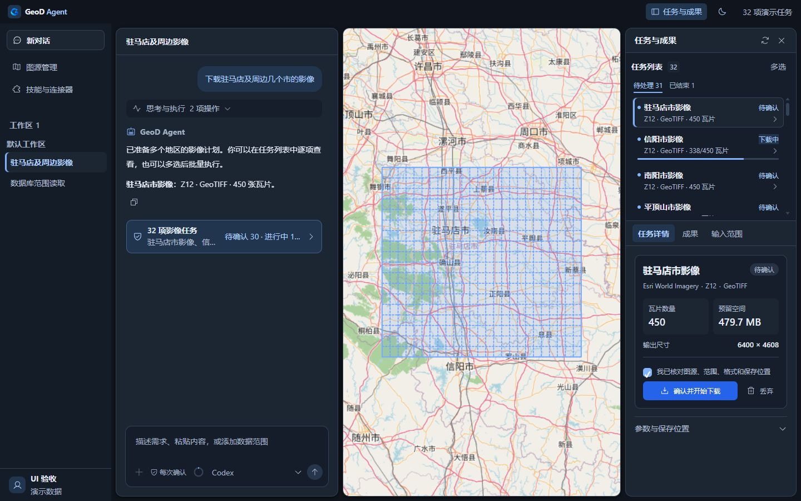
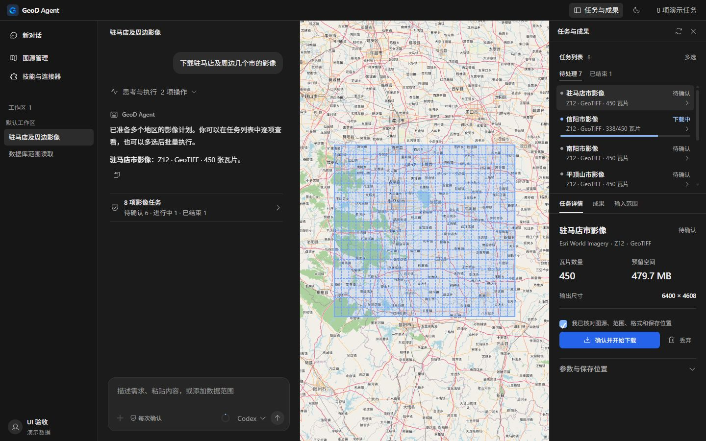
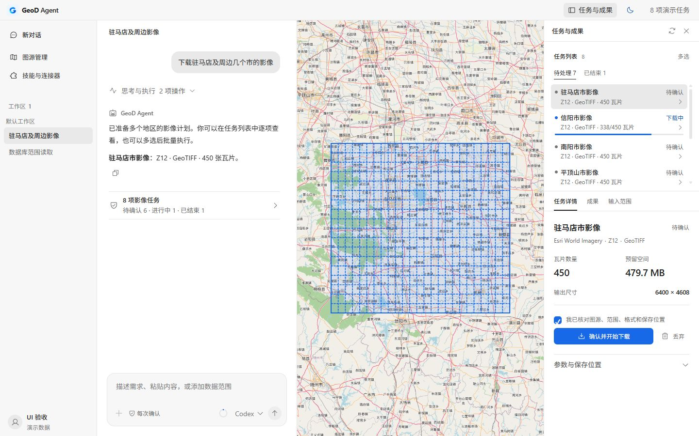
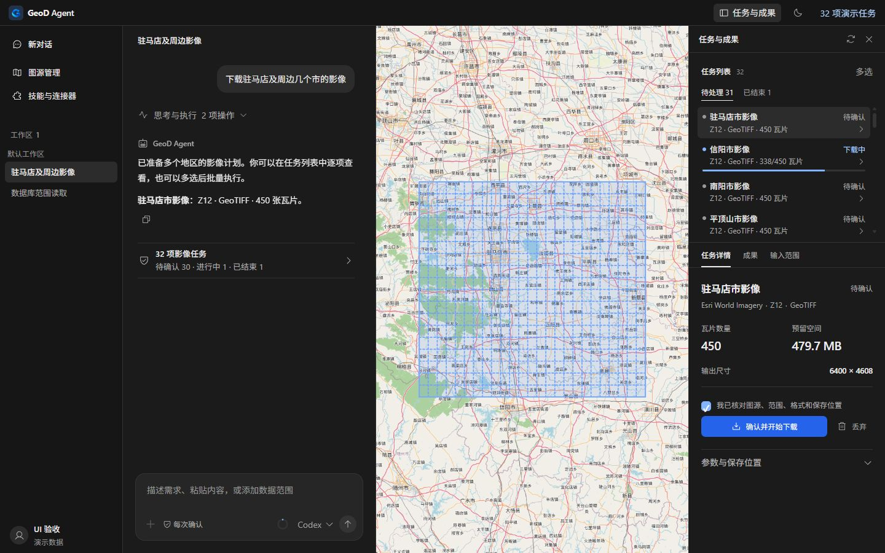
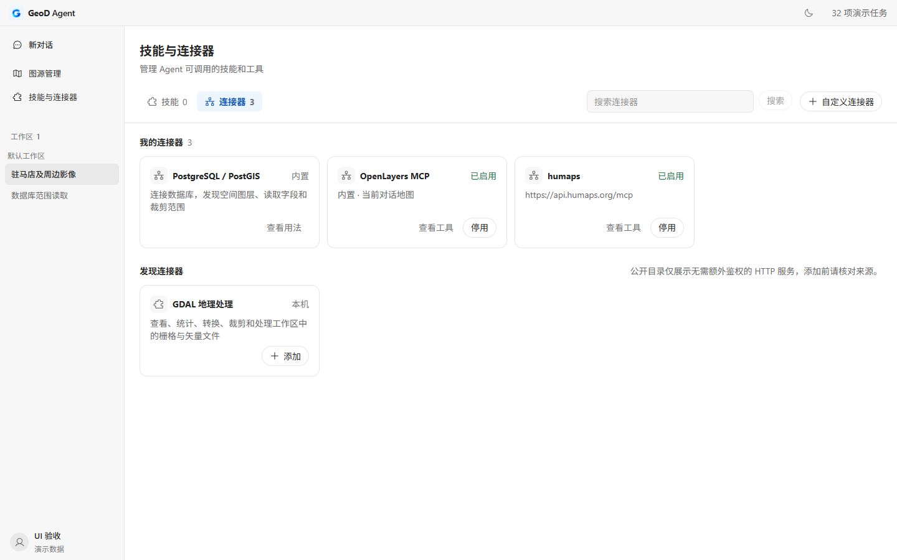
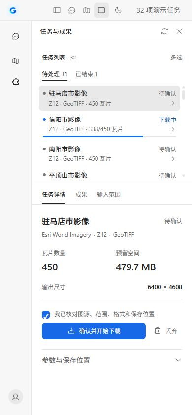

# UI 第三轮：平整工作台

## 为什么重新调整

用户反馈上一轮视觉仍显得老旧。核对截图后，主要问题是蓝灰底色叠加多个描边、面板留缝与圆角、任务详情和统计值再次套卡片，以及大量相同的粗字和蓝色状态。

本轮方向：接近用户指定的 Codex 工作台，采用连续分栏、中性灰阶、明确但克制的文字层级，蓝色用于主要操作和运行进度。继续沿用已有 React、beUI、Motion 组件。

## 本轮改动

- 外层工作台改为连续分栏，移除主面板的边距、圆角与阴影，以单条分隔线标识区域。覆盖式任务面板仍保留出入动效，坐标与拖动宽度使用同一来源。
- 侧栏的选中会话改为中性填充，移除蓝色竖线和“新对话”的独立框。导航、工作区分组、会话时间和账号信息区分字重与字号。
- 深色采用中性炭灰，浅色采用白色和浅灰，颜色统一在 theme.css 中定义。
- 核对本机注册字体：Segoe UI Variable、Noto Sans SC、Microsoft YaHei UI 均存在。中文优先使用 Noto Sans SC，保留系统字体回退；正文仍是 14px，强调与标题改为 600 字重，避免整段文本都显得粗重。
- 思考与执行摘要改为无底色行；完成后整轮收起、展开动效和流式动画沿用原组件。
- 任务列表保留独立滚动，去掉条目描边与彩色等待标签，选中使用中性填充。下载进度和状态点仍突出显示。
- 任务详情移除外卡片与统计小卡片，用排版区分区域名称、服务与格式、数量和空间。确认、丢弃、暂停、恢复、取消及批量处理仍接原回调。
- 聊天中的批量任务入口保持单条，两行展示总数与状态汇总，具体地区通过工具提示与任务列表查看。
- 输入工具栏把上下文圆环和模型菜单靠右排列；模型箭头紧随名称。修复模型菜单在窄窗口向右越界的问题，菜单改为靠触发按钮右侧展开。
- 图源和连接器页面沿用页内布局，卡片、图标、侧栏与主界面共用中性色，不再叠加蓝灰底色。

## 验证

- `npm run build` 通过。现有主 JS 大包提示仍存在，本轮未修改代码分包。
- 26 项布局、整轮折叠、任务队列、批量动作和任务汇总测试通过。
- 使用实际产品组件的隔离演示页验收：1440×900 深浅色、1280×720 覆盖面板、390×844 单面板视图，无页面水平溢出。
- 32 项任务：任务列表滚动区域高 210px，滚动内容高 1651px；聊天摘要总高 58px。
- 390px 窗口：输入工具栏高 32px，宽与 scrollWidth 均为 263px；模型展开菜单位于 x=119..327，完整处于窗口内。
- 确认按钮选中复选框后启用，浅色主色为 rgb(23,105,232)，文字为白色。未勾选时仍禁用且文字可辨。
- 键盘调整对话/地图分隔线实测 400→412→400，布局保存逻辑保留。
- 覆盖面板进入动效结束后边界为 x=928..1280，宽 352px；未发现浏览器错误日志。
- 原生开发窗口仍连接 `http://127.0.0.1:1420/`，继续使用 Vite 热更新。此次没有重新安装、发布网关或调用付费模型。

## 截图

这些截图使用实际产品组件与隔离演示数据，不表示实际 AI 对话或真实下载结果。地图和业务能力未通过截图作额外功能声明。

上一轮：

本轮：

