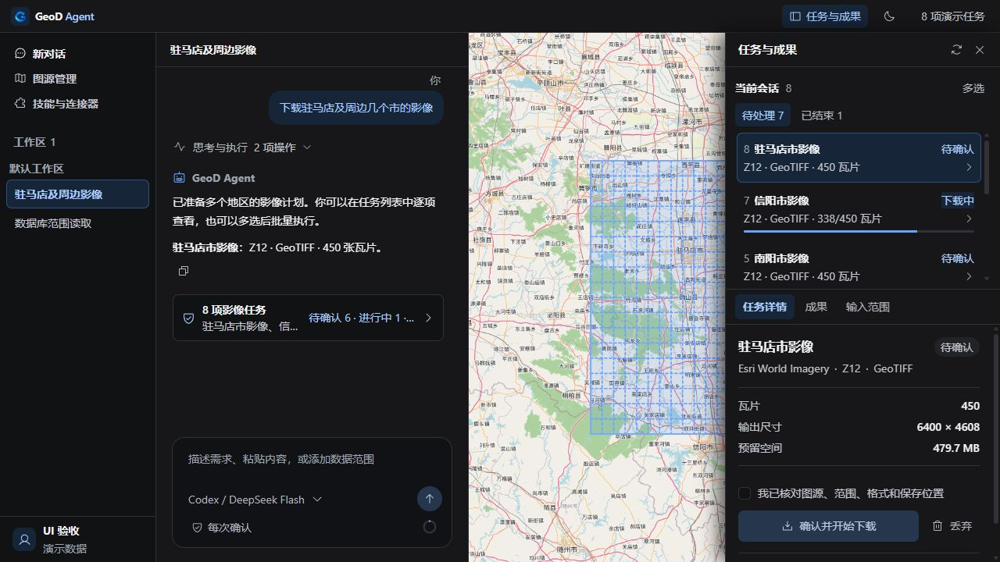
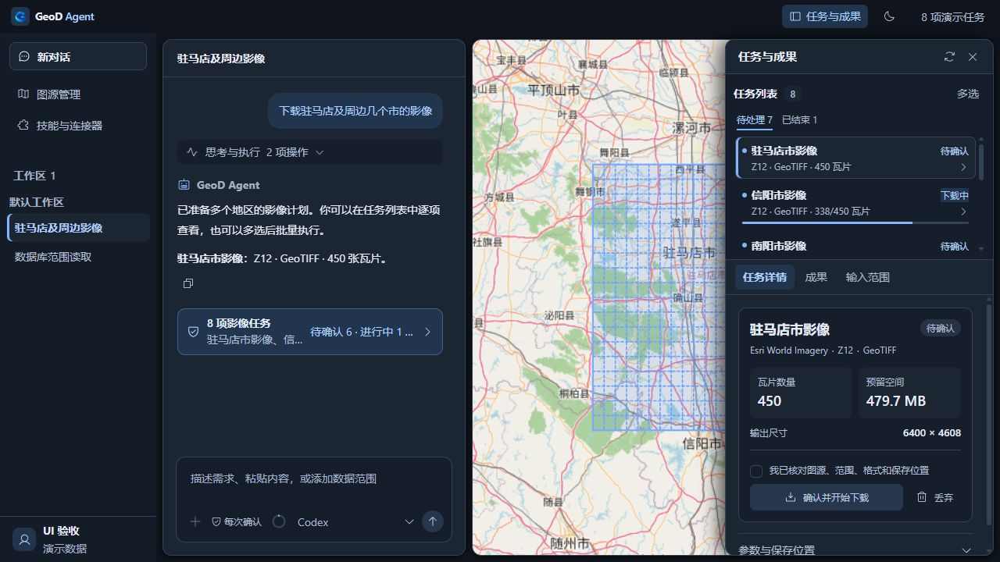

# UI v2 第二轮：可见的视觉重排

用户反馈上一版变化不明显。本轮直接改动开发版中的主题、面板和组件排版，保留已有业务操作、四区布局及动效。

## 可见变化

| 区域 | 这轮改动 |
| --- | --- |
| 整体 | 浅色使用蓝灰外框和白色工作面；暗色使用深蓝灰层次。导航独立底色，对话、地图和任务采用有间隔的圆角面板。 |
| 导航 | 新对话入口独立；当前对话用亮色表面和左侧蓝色标记，区别于普通列表项。 |
| 对话 | 隐去用户气泡上冗余的“你”，调整中文行距，整轮思考与执行使用独立背景，任务汇总入口使用蓝色状态面。 |
| 输入栏 | 取消窄宽度下的随意换行，添加、权限、上下文环、模型和发送保持一行；窄窗口显示模型短名称，菜单和无障碍名称保留完整模型。 |
| 任务 | 列表行最小高度从 62px 降至 48px，去掉主标题前的序号，加入状态点；关键数量与空间采用两列摘要，尺寸、确认和丢弃紧凑排列。队列最多占面板高度的 36%。 |
| 图源 | 将全宽列表改为响应式卡片网格，仍可查看详情和编辑配置。 |
| 连接器 | 标题与工具栏层级更清楚，目录卡片使用与页面有区别的表面色，保留页内详情。 |

## 验证

- TypeScript 与 Vite 构建通过；原有大 bundle 提示仍存在。
- 布局、任务队列、整轮记录和任务摘要的 26 项相关测试通过。
- 浏览器检查浅色与暗色工作台、图源和连接器页面；检查 390px、1280px、1440px 窗口及 8/32 项任务。
- 检查输入栏保持 32px 单行高度、无横向溢出、窄窗口任务操作可见、列表独立滚动。
- 检查分隔条键盘调整：对话工作面宽度从 400px 到 412px，再恢复；保留原有拖动实现。
- 检查紧凑模型入口可以展开完整模型名称；补全共享 SelectTrigger 的 aria-label 传递。
- 检查确认按钮启用和禁用颜色：浅色启用为白字和 #1769e8 背景，禁用为 #53677e 字和 #e3ebf6 背景，透明度均为 1。
- 最后浏览器检查没有 error 日志。
- 当前原生开发进程的 WebView 地址是 `http://127.0.0.1:1420/`，与本次修改的 Vite 入口一致，使用热更新。

## 前后对照

截图来自导入实际产品组件的独立验收页，使用演示任务、账户与清单。它们用于验证布局和样式，不能作为真实 AI、数据库或下载执行证据。原生窗口本轮未截图。

### 修改前，1280px

### 修改后，1280px

### 其他检查视图

- [暗色工作台，1440px，32 项任务](evidence/ui-v2/workbench-visual-dark-1440.png)
- [浅色工作台，1440px](evidence/ui-v2/workbench-visual-light-1440.png)
- [图源网格](evidence/ui-v2/sources-visual-light-1280.png)
- [连接器目录](evidence/ui-v2/connectors-visual-light-1280.png)
- [390px 任务区](evidence/ui-v2/tasks-visual-light-390.png)

本轮未重跑付费模型、数据库与下载流程，未重新安装或发布。
